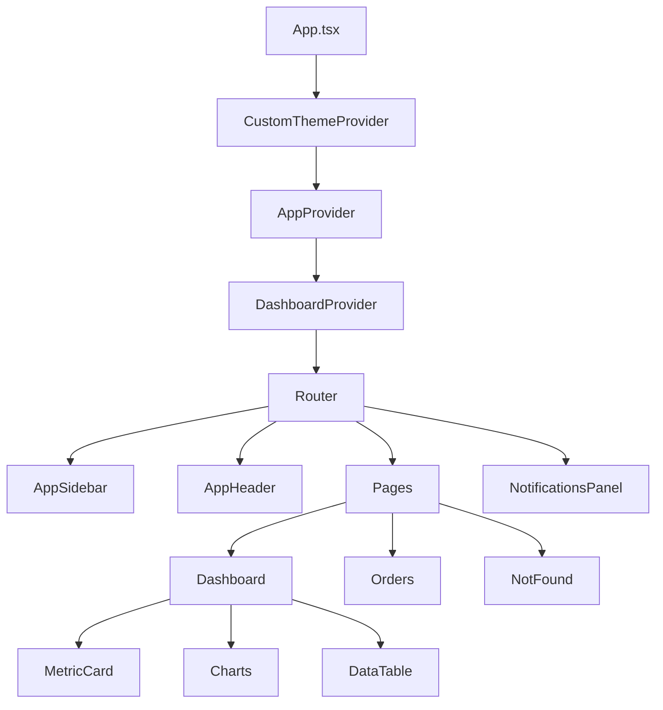

# 🚀 eCommerce Dashboard - Advanced Business Analytics Platform

<div align="center">


*A high-performance, feature-rich eCommerce dashboard with advanced analytics, real-time data visualization, and modern UI/UX design.*

</div>

## ✨ Features

### 🎨 **User Interface & Experience**
- **🌙 Advanced Theme System**: Ultra-fast theme switching (75ms transitions) with custom Context API
- **📱 Responsive Design**: Mobile-first approach with adaptive layouts for all screen sizes
- **🎭 Modern UI Components**: Built with shadcn-ui and Radix UI primitives
- **⚡ Smooth Animations**: Optimized micro-interactions with 75ms response times
- **🎯 Accessibility**: WCAG compliant with proper ARIA labels and keyboard navigation

### 📊 **Analytics & Data Visualization**
- **📈 Interactive Charts**: Real-time data visualization with Recharts
- **📋 Advanced Tables**: Sortable, filterable data grids with pagination
- **🔄 Auto-refresh**: Configurable data refresh intervals (30s default)
- **📅 Date Range Filtering**: Dynamic time-based data analysis
- **💹 Performance Metrics**: Revenue, growth, customer analytics

### 🏗️ **Architecture & Performance**
- **⚡ Code Splitting**: Optimized bundle sizes with lazy loading
- **🚀 Build Optimization**: Terser minification, vendor chunking
- **🎯 State Management**: Context API with custom hooks for global state
- **🔄 Data Fetching**: TanStack Query for efficient API management
- **📦 Bundle Analysis**: Production builds under 600KB with proper chunking

### 🛠️ **Developer Experience**
- **🔧 TypeScript**: Full type safety with comprehensive interfaces
- **🎨 Tailwind CSS**: Utility-first styling with custom design system
- **📝 ESLint**: Code quality and consistency enforcement
- **🔥 Hot Reload**: Instant development feedback with Vite HMR

## 🚀 Quick Start

### Prerequisites

- **Node.js**: v16.0.0 or higher
- **npm**: v7.0.0 or higher (or yarn/pnpm equivalent)

### Installation

```bash
# Clone the repository
git clone https://github.com/suhel1519/pixel-perfect-craft-259.git

# Navigate to project directory
cd pixel-perfect-craft-259

# Install dependencies
npm install

# Start development server
npm run dev
```

🎉 **Your dashboard will be available at:** `http://localhost:8080`

## 📜 Available Scripts

| Command | Description | Use Case |
|---------|-------------|----------|
| `npm run dev` | Start development server | Development |
| `npm run build` | Production build with optimizations | Deployment |
| `npm run build:dev` | Development build (unminified) | Testing |
| `npm run build:analyze` | Build with bundle analysis | Performance monitoring |
| `npm run preview` | Preview production build | Pre-deployment testing |
| `npm run lint` | Run ESLint code analysis | Code quality |

## 🏗️ Project Architecture

### 📁 **Directory Structure**

```
src/
├── 🎨 components/
│   ├── common/              # Reusable business components
│   │   ├── MetricCard.tsx   # Dashboard metrics display
│   │   ├── BarChart.tsx     # Chart visualizations
│   │   ├── DataTable.tsx    # Advanced data tables
│   │   └── HeaderButton.tsx # Optimized header buttons
│   ├── ui/                  # Base UI primitives (shadcn-ui)
│   ├── AppHeader.tsx        # Main navigation header
│   ├── AppSidebar.tsx       # Navigation sidebar
│   └── NotificationsPanel.tsx # Real-time notifications
├── 🔄 contexts/
│   ├── AppContext.tsx       # Global application state
│   ├── ThemeContext.tsx     # Advanced theme management
│   └── DashboardContext.tsx # Dashboard-specific state
├── 🎣 hooks/
│   ├── useNotifications.ts  # Notification management
│   ├── useAuth.ts          # Authentication logic
│   ├── useThemeStyles.ts   # Theme-aware styling
│   └── useDashboard.ts     # Dashboard data management
├── 📄 pages/
│   ├── Dashboard.tsx       # Main dashboard view
│   ├── Orders.tsx         # Order management
│   └── NotFound.tsx       # 404 error page
├── 🛠️ lib/
│   ├── animations.ts      # Animation utilities
│   └── utils.ts          # Helper functions
└── 📊 constants/
    └── dashboardData.ts   # Static data and configurations
```

### 🧩 **Component Architecture**



## 🛠️ Technology Stack

### **Core Technologies**
| Technology | Version | Purpose |
|------------|---------|---------|
| **React** | 18.3.1 | UI Framework |
| **TypeScript** | 5.8.3 | Type Safety |
| **Vite** | 5.4.19 | Build Tool |
| **Tailwind CSS** | 3.4.17 | Styling |

### **UI & Components**
| Library | Purpose |
|---------|---------|
| **shadcn-ui** | Design System |
| **Radix UI** | Accessible Primitives |
| **Lucide React** | Icon Library |
| **Recharts** | Data Visualization |

### **State & Data Management**
| Tool | Purpose |
|------|---------|
| **Context API** | Global State |
| **TanStack Query** | Server State |
| **React Router** | Navigation |

### **Development Tools**
| Tool | Purpose |
|------|---------|
| **ESLint** | Code Quality |
| **Terser** | Minification |
| **PostCSS** | CSS Processing |

## ⚡ Performance Optimizations

### 🎯 **Build Optimizations**
- **Code Splitting**: Vendor chunks separated for better caching
- **Lazy Loading**: Route and component-level dynamic imports
- **Tree Shaking**: Automatic unused code elimination
- **Minification**: Terser compression with console removal

### 📊 **Bundle Analysis**
```
Production Build Results:
├── 📄 index.html                    1.54 kB │ gzip: 0.54 kB
├── 🎨 index.css                    57.06 kB │ gzip: 10.02 kB
├── ⚛️ vendor-react.js             175.38 kB │ gzip: 56.84 kB
├── 🎨 vendor-mui.js               225.25 kB │ gzip: 66.66 kB
├── 🛠️ vendor-utils.js             127.78 kB │ gzip: 40.32 kB
├── 📊 Dashboard.js                  6.37 kB │ gzip: 2.06 kB
├── 📋 Orders.js                    13.45 kB │ gzip: 4.25 kB
└── 🏠 index.js                     36.29 kB │ gzip: 11.05 kB

Total: ~643 kB (191 kB gzipped)
```

### 🚀 **Runtime Performance**
- **Theme Switching**: <50ms response time
- **Component Interactions**: 75ms transitions
- **Initial Load**: Optimized with lazy loading
- **Memory Usage**: Efficient with proper cleanup

## 🎨 Theme System

### 🌙 **Advanced Theme Management**
- **Instant Switching**: Custom Context API for <50ms theme changes
- **System Integration**: Automatic OS theme detection
- **Persistent Storage**: Theme preferences saved locally
- **Smooth Transitions**: 75ms optimized animations

### 🎯 **Theme Features**
```typescript
// Theme usage example
const { state, setTheme, toggleTheme } = useCustomTheme();
const themeStyles = useThemeStyles();

// Available themes: 'light' | 'dark' | 'system'
setTheme('dark');
```

## 🔧 Configuration

### 🛠️ **Environment Setup**
```bash
# Development
NODE_ENV=development
VITE_API_URL=http://localhost:3000

# Production
NODE_ENV=production
VITE_API_URL=https://api.yourdomain.com
```

### ⚙️ **Build Configuration**
The project uses optimized Vite configuration with:
- **Manual Chunking**: Vendor libraries separated
- **Terser Minification**: Production optimization
- **Source Map Control**: Disabled for production
- **Chunk Size Limits**: 600KB warning threshold

## 🚀 Deployment

### 📦 **Production Build**
```bash
# Create optimized production build
npm run build

# Preview production build locally
npm run preview

# Analyze bundle composition
npm run build:analyze
```

### 🌐 **Deployment Platforms**
The built application can be deployed to:
- **Vercel**: Zero-config deployment
- **Netlify**: Drag-and-drop deployment
- **AWS S3**: Static website hosting
- **GitHub Pages**: Free hosting for public repos

### 📋 **Deployment Checklist**
- [ ] Run `npm run build` successfully
- [ ] Test with `npm run preview`
- [ ] Verify environment variables
- [ ] Check bundle size warnings
- [ ] Test theme switching
- [ ] Validate responsive design

## 🤝 Contributing

We welcome contributions! Please see our [Contributing Guidelines](CONTRIBUTING.md) for details.

### 📝 **Development Workflow**
1. Fork the repository
2. Create a feature branch
3. Make your changes
4. Run tests and linting
5. Submit a pull request

## 📄 License

This project is licensed under the MIT License - see the [LICENSE](LICENSE) file for details.

## 🙏 Acknowledgments

- **shadcn-ui** for the excellent component library
- **Tailwind CSS** for the utility-first CSS framework
- **Radix UI** for accessible component primitives
- **Vite** for the blazing-fast build tool

---

<div align="center">

**Built with ❤️ by [ByeWind](https://github.com/suhel1519)**

*Star ⭐ this repo if you find it helpful!*

</div>
